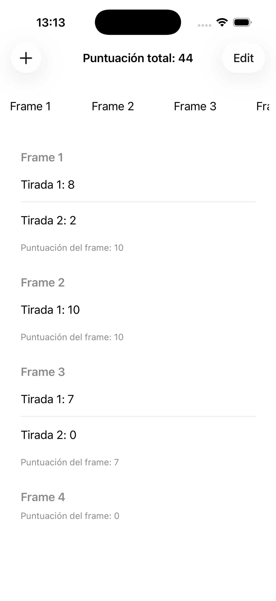
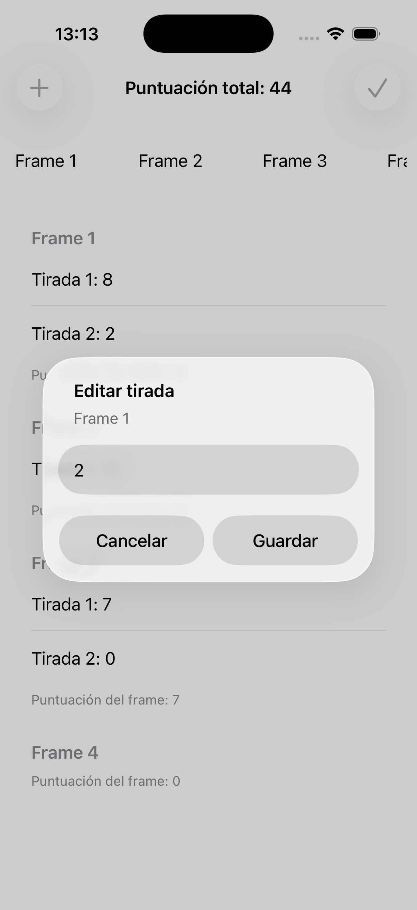
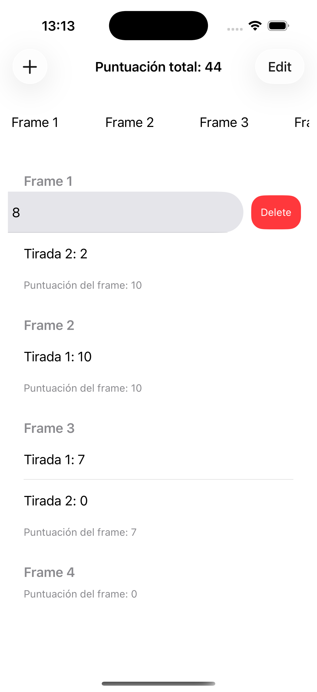

# Bowling Score iOS

Aplicación nativa desarrollada con **Swift y UIKit** para registrar las tiradas de una partida de bolos y consultar su puntuación.

  
  
  
    

> Proyecto formativo creado para practicar el funcionamiento de los principales componentes de UIKit y la gestión de interfaces dinámicas bajo la tutela de un senior.

## ¿Qué permite hacer?

La aplicación organiza la partida por frames y permite:

* Consultar las tiradas y la puntuación de cada frame.
* Navegar horizontalmente entre los diferentes frames.
* Registrar nuevas tiradas introduciendo el número de bolos derribados.
* Editar o eliminar tiradas existentes.
* Consultar la puntuación total actualizada de la partida.

La interfaz se actualiza conforme se modifican las tiradas, manteniendo sincronizados el frame seleccionado, su contenido y la puntuación total. Ante errores en la edición/eliminación/adición de tiradas, la aplicación lanza avisos de error.

## Stack

`Swift` · `UIKit` · `UICollectionView` · `UITableView` · `UINavigationController` · `UIAlertController`

El proyecto utiliza componentes nativos de UIKit para mostrar información reutilizable, gestionar la navegación y presentar formularios de creación y edición.
